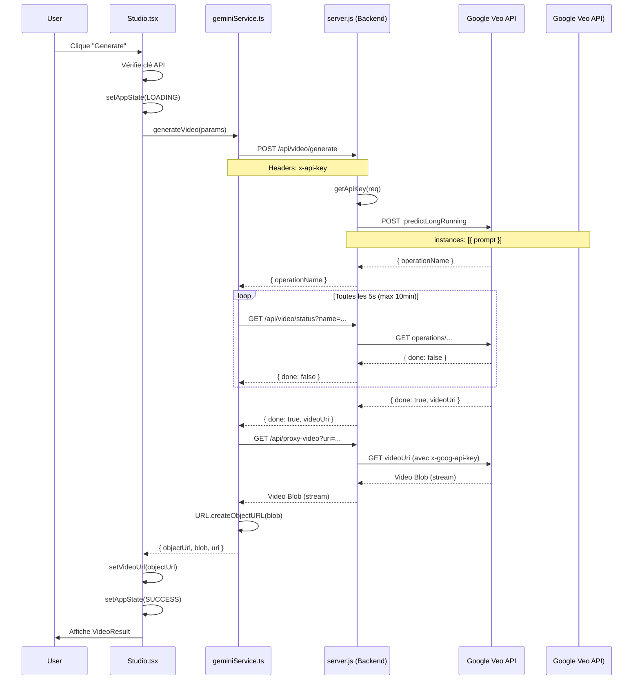

# 📹 Flux Front ↔ Veo (Vue d'ensemble)

## 🎯 Vue générale

Ce document décrit **comment l'utilisateur génère une vidéo avec Veo** dans Studio Jenial, depuis le clic sur "Generate" jusqu'à l'affichage du résultat.

---

## 📋 Étapes Utilisateur → Système

### 1️⃣ **L'utilisateur prépare sa génération**

**Composant UI:** [`Studio.tsx`](file:///K:/studio_jenial/Studio.tsx)  
**État initial:** `currentStage = AppStage.PROMPTING`

L'utilisateur interagit avec le composant `PromptSequenceAssistant` qui affiche :
- Un champ de prompt texte
- Des options de modèle Veo (`VeoModel.VEO_3_1_004`, etc.)
- Des paramètres (aspect ratio, résolution)
- Possibilité d'uploader des images de référence

---

### 2️⃣ **L'utilisateur clique sur "Generate"**

**Fonction déclenchée:** [`handleGenerate(params)`](file:///K:/studio_jenial/Studio.tsx#L472-L650)  
**Lieu:** `Studio.tsx` ligne 472

#### Vérifications préliminaires

```typescript
// 1. Vérification de la clé API
if (!getApiKey()) {
  setShowApiKeyDialog(true);
  return;
}
```

**Résultat:**
- ✅ Si clé présente → continue
- ❌ Si clé absente → affiche la modale `ApiKeyDialog`

#### Transition d'état

```typescript
setAppState(AppState.LOADING);
setErrorMessage(null);
```

L'UI affiche maintenant le composant `LoadingIndicator` avec possibilité d'annulation.

---

### 3️⃣ **Appel au service frontend**

**Fonction appelée:** [`generateVideo(params, signal)`](file:///K:/studio_jenial/services/geminiService.ts#L385-L559)  
**Fichier:** `services/geminiService.ts`

#### Construction de la requête

```typescript
const finalPrompt = params.prompt; // + éventuelles instructions spéciales
const parameters = {
  resolution: params.resolution,    // ex: "720p"
  aspectRatio: params.aspectRatio   // ex: "16:9"
};
```

---

### 4️⃣ **Premier appel backend: START generation**

**Endpoint:** `POST /api/video/generate`  
**Fichier backend:** [`server.js`](file:///K:/studio_jenial/server.js#L162-L242) ligne 162

#### Headers envoyés

```javascript
{
  'Content-Type': 'application/json',
  'x-api-key': apiKey  // clé utilisateur (BYOK) ou clé serveur
}
```

#### Body envoyé

```json
{
  "model": "veo-3.1-004",
  "prompt": "A cinematic shot of a sunset over mountains",
  "parameters": {
    "resolution": "720p",
    "aspectRatio": "16:9"
  }
}
```

#### Traitement backend

Le serveur construit une requête vers l'API Google Veo :

**URL appelée:**  
```
POST https://generativelanguage.googleapis.com/v1beta/models/veo-3.1-004:predictLongRunning
```

**Format de requête (spécifique Veo 3.1):**
```json
{
  "instances": [{ "prompt": "A cinematic shot..." }],
  "parameters": {
    "resolution": "720p",
    "aspectRatio": "16:9"
  }
}
```

> ⚠️ **IMPORTANT:** Le format `instances` est obligatoire pour l'API Veo 3.1. Le serveur utilise `predictLongRunning` (pas `generateContent`).

#### Réponse du backend

**Si succès (200):**
```json
{
  "operationName": "operations/12345abcdef"
}
```

**Si erreur 404 (modèle non trouvé):**
```json
{
  "error": "MODEL_NOT_FOUND",
  "details": "Model \"veo-3.1-004\" is not available..."
}
```

**Si erreur 401 (clé invalide):**
```json
{
  "error": "API_KEY_INVALID",
  "details": "API key not valid..."
}
```

---

### 5️⃣ **Polling: attente de la génération**

**Boucle de polling:** [`geminiService.ts`](file:///K:/studio_jenial/services/geminiService.ts#L458-L497) ligne 458

Une fois `operationName` reçu, le frontend interroge régulièrement le backend :

**Endpoint:** `GET /api/video/status?name=operations/12345abcdef`  
**Intervalle:** toutes les **5 secondes**  
**Timeout:** 120 polls max (= 10 minutes)

#### Réponse en cours de génération

```json
{
  "done": false
}
```

Le frontend affiche : `"Generating video... (25s elapsed)"`

#### Réponse quand terminé

```json
{
  "done": true,
  "videoUri": "https://generativelanguage.googleapis.com/v1beta/files/abc123:download?alt=media"
}
```

---

### 6️⃣ **Téléchargement de la vidéo**

**Endpoint proxy:** `GET /api/proxy-video?uri=...`  
**Fichier backend:** [`server.js`](file:///K:/studio_jenial/server.js#L317-L383) ligne 317

#### Sécurité du proxy

Le serveur vérifie que l'URL provient bien de Google :

```javascript
const ALLOWED_PROXY_PATTERNS = [
  /^https:\/\/generativelanguage\.googleapis\.com\/v1beta\/files\//
];
```

> 🔒 **Protection SSRF:** Le proxy bloque les IPs privées (localhost, 192.168.x.x, etc.)

#### Streaming de la vidéo

Le serveur télécharge la vidéo depuis Google et la stream directement au client :

```javascript
await pipeline(response.body, res);
```

Le frontend reçoit un `Blob` et crée un `objectUrl` :

```typescript
const videoBlob = await downloadResponse.blob();
const objectUrl = URL.createObjectURL(videoBlob);
```

---

### 7️⃣ **Affichage du résultat**

**Composant UI:** `VideoResult`  
**État final:**
```typescript
setVideoUrl(objectUrl);
setAppState(AppState.SUCCESS);
setCurrentStage(AppStage.RESULT);
```

L'utilisateur voit :
- ✅ La vidéo générée dans un lecteur HTML5
- 🔄 Bouton "Retry"
- ➕ Bouton "Extend Video" (si modèle compatible)
- 💾 Bouton "Save to Library"

---

## 🔄 Récapitulatif du flux complet



---

## 📦 Structure des données clés

### Interface `GenerateVideoParams`

```typescript
{
  prompt: string;
  model: VeoModel;          // "veo-3.1-004"
  aspectRatio?: string;     // "16:9", "9:16", "1:1"
  resolution?: string;      // "720p", "1080p"
  mode: GenerationMode;     // TEXT_TO_VIDEO, FRAMES_TO_VIDEO, etc.
  startFrame?: ImageFile;
  endFrame?: ImageFile;
  referenceImages?: ImageFile[];
  inputVideo?: VideoFile;
  inputVideoObject?: any;
}
```

### Réponse finale `generateVideo`

```typescript
{
  objectUrl: string;        // blob:https://... (pour <video> HTML)
  blob: Blob;              // Données binaires de la vidéo
  uri: string;             // URI Google original
  video: { uri: string };  // Objet pour extensions
  supabaseUrl?: string;    // Optionnel si configuré
}
```

---

## 🎨 Modes de génération disponibles

| Mode | Description | Paramètres requis |
|------|-------------|-------------------|
| `TEXT_TO_VIDEO` | Génération depuis texte uniquement | `prompt` |
| `FRAMES_TO_VIDEO` | Animation d'une image | `prompt`, `startFrame` |
| `EXTEND_VIDEO` | Extension d'une vidéo existante | `inputVideoObject`, `prompt` |
| `REFERENCES_TO_VIDEO` | Génération avec images de référence | `prompt`, `referenceImages` |

---

## 🔑 Gestion de la clé API (Dual Mode)

Le système supporte 2 modes :

### Mode 1: Server-Managed
- Variable d'env `GEMINI_API_KEY` définie sur le serveur
- Les utilisateurs n'ont pas besoin de fournir de clé
- Header `x-api-key` ignoré par le backend

### Mode 2: BYOK (Bring Your Own Key)
- Variable d'env `GEMINI_API_KEY` non définie
- Chaque utilisateur fournit sa propre clé
- Clé stockée dans `localStorage` (frontend)
- Clé envoyée via header `x-api-key`

**Endpoint de configuration:**
```
GET /api/config
→ { hasServerKey: boolean, requiresUserKey: boolean }
```

Le frontend appelle cet endpoint au démarrage pour déterminer le mode.

---

## ⏱️ Temps de génération typiques

> Basé sur l'observation du code de polling

- **Minimum:** ~20-30 secondes (vidéos simples)
- **Moyen:** 1-2 minutes
- **Maximum:** 10 minutes (timeout)

Le frontend affiche le temps écoulé toutes les 5 secondes pendant le polling.
