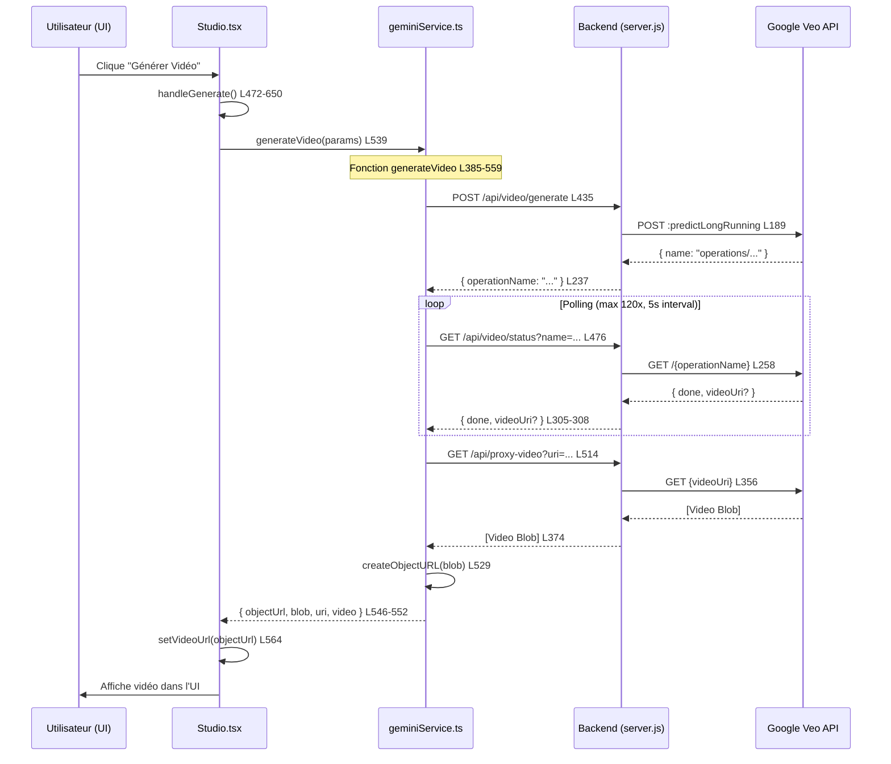

# 📊 Rapport de Cartographie - Appels API Veo Frontend

**Mode**: Lecture Seule (Read-Only)  
**Date**: 2025-12-07  
**Projet**: Studio Jenial  
**Objectif**: Cartographier tous les appels API Veo côté frontend sans modification

---

## 🎯 Résumé Exécutif

Le frontend de Studio Jenial utilise **uniquement les endpoints modernes** pour la génération vidéo Veo 3.1. Les anciens endpoints legacy existent **uniquement côté backend** pour rétrocompatibilité, mais **ne sont plus appelés par le frontend actuel**.

### Architecture Actuelle
- ✅ **Frontend → Backend moderne** : `/api/video/generate` + `/api/video/status`
- ✅ **Backend → Google Veo API** : `predictLongRunning` format `instances`
- ⚠️ **Endpoints legacy** : Présents côté backend uniquement (sécurité de rétrocompatibilité)

---

## 📍 Section 1 : Endpoints Utilisés Actuellement

### Endpoint Principal : `/api/video/generate`

**Fichier source** : [`geminiService.ts`](file:///k:/studio_jenial/services/geminiService.ts#L385-L559)

**Ligne de code** : L431-456
```typescript
// 1. Start Generation using /api/video/generate endpoint
onProgress?.('Starting video generation...');
console.log('[Veo] Calling /api/video/generate...');

const startResponse = await fetch(`${API_BASE}/video/generate`, {
  method: 'POST',
  headers: {
    'Content-Type': 'application/json',
    'x-api-key': apiKey,
  },
  body: JSON.stringify({
    model: params.model,
    prompt: finalPrompt.trim(),
    parameters: Object.keys(parameters).length > 0 ? parameters : undefined,
  }),
  signal,
});
```

**Fonction** : `generateVideo` (ligne 385-559)  
**Composant appelant** : [`Studio.tsx`](file:///k:/studio_jenial/Studio.tsx#L539)

**Flux d'appel** :
1. L'utilisateur clique sur "Générer" dans `Studio.tsx` (ligne 539)
2. `handleGenerate()` (ligne 472-650) est invoquée
3. Appel de `generateVideo()` depuis `geminiService.ts` (ligne 539)
4. Requête POST vers `/api/video/generate` avec le prompt et paramètres

**Réponse attendue** :
```typescript
{ operationName: string }
```

---

### Endpoint de Polling : `/api/video/status`

**Fichier source** : [`geminiService.ts`](file:///k:/studio_jenial/services/geminiService.ts#L476-492)

**Ligne de code** : L476-492
```typescript
const statusResponse = await fetch(
  `${API_BASE}/video/status?name=${encodeURIComponent(operationName)}`,
  {
    method: 'GET',
    headers: {
      'x-api-key': apiKey,
    },
    signal,
  }
);
```

**Fonction** : `generateVideo` (polling loop à l'intérieur)  
**Fréquence de polling** : Toutes les 5 secondes (ligne 470)  
**Timeout maximum** : 120 polls = 10 minutes (ligne 461)

**Réponse attendue** :
```typescript
{
  done: boolean;
  videoUri?: string;
  error?: string;
}
```

---

### Endpoint de Téléchargement : `/api/proxy-video`

**Fichier source** : [`geminiService.ts`](file:///k:/studio_jenial/services/geminiService.ts#L513-522)

**Ligne de code** : L513-522
```typescript
const downloadResponse = await fetch(
  `${API_BASE}/proxy-video?uri=${encodeURIComponent(status.videoUri)}`,
  {
    method: 'GET',
    headers: {
      'x-api-key': apiKey,
    },
    signal,
  }
);
```

**Fonction** : `generateVideo` (téléchargement final)  
**Réponse attendue** : Blob vidéo binaire (MP4)

---

## 🔍 Section 2 : Endpoints Legacy (Backend Uniquement)

### ⚠️ Constatation Importante

Les endpoints legacy **NE SONT PLUS UTILISÉS PAR LE FRONTEND**. Ils sont présents uniquement côté backend pour rétrocompatibilité.

### Endpoint Legacy 1 : `/api/generate-videos`

**Emplacement** : [`server.js`](file:///k:/studio_jenial/server.js#L386-453) (lignes 386-453)  
**Statut** : 🔴 **NON utilisé par le frontend actuel**  
**Objectif** : Rétrocompatibilité avec d'anciennes versions ou scripts externes

**Comportement actuel** :
```javascript
app.post('/api/generate-videos', async (req, res) => {
  console.log('[Veo] Legacy /api/generate-videos called - redirecting to new API');
  // Redirige vers predictLongRunning en interne
  // Retourne { operationName, message }
});
```

**Conclusion** : Aucun fichier frontend ne contient d'appel direct à `generate-videos`. Cet endpoint est safe à conserver pour compatibilité externe.

---

### Endpoint Legacy 2 : `/api/get-video-operation`

**Emplacement** : [`server.js`](file:///k:/studio_jenial/server.js#L456-501) (lignes 456-501)  
**Statut** : 🔴 **NON utilisé par le frontend actuel**  
**Objectif** : Rétrocompatibilité pour polling legacy

**Comportement actuel** :
```javascript
app.post('/api/get-video-operation', async (req, res) => {
  console.log('[Veo] Legacy /api/get-video-operation called');
  // Poll l'opération Veo via VEO_API_BASE
  // Retourne { done, videoUri, response }
});
```

**Conclusion** : Aucun fichier frontend ne contient d'appel direct. Safe à conserver.

---

## 🔄 Section 3 : Compréhension du Flux Complet

### Flux de Génération Vidéo (Mode Lecture Seule)



### Détails Techniques

#### 1. **Déclenchement Initial**
- **Fichier** : [`Studio.tsx`](file:///k:/studio_jenial/Studio.tsx#L539)
- **Fonction** : `handleGenerate` (lignes 472-650)
- **Validation** : Vérifie la clé API (ligne 475-478)
- **Gestion d'état** : Met AppState en LOADING (ligne 514)

#### 2. **Construction des Paramètres**
- **Fichier** : [`geminiService.ts`](file:///k:/studio_jenial/services/geminiService.ts#L398-429)
- **Parameters** : `resolution`, `aspectRatio` selon le mode
- **Prompt enrichi** : Ajout d'instructions CRITICAL pour `FRAMES_TO_VIDEO` (ligne 417-420)

#### 3. **Start Generation**
- **Endpoint** : `/api/video/generate`
- **Body** : `{ model, prompt, parameters }`
- **Headers** : `x-api-key` (clé utilisateur BYOK ou serveur)

#### 4. **Backend Processing**
- **Fichier** : [`server.js`](file:///k:/studio_jenial/server.js#L162-242)
- **Format** : Convertit en format `instances` pour Veo (ligne 177-185)
- **API Call** : `predictLongRunning` vers Google Veo (ligne 189)

#### 5. **Polling Loop**
- **Intervalle** : 5 secondes (ligne 470)
- **Max attempts** : 120 fois = 10 minutes
- **Callback UI** : `onProgress?.()` pour afficher le temps écoulé (ligne 473)

#### 6. **Téléchargement Final**
- **Proxy sécurisé** : `/api/proxy-video` (sécurité SSRF)
- **Validation** : Pattern whitelist pour URLs Google uniquement (server.js L341-350)
- **Streaming** : Pipeline Node.js pour efficacité (server.js L374)

#### 7. **Post-traitement**
- **Thumbnail** : Génération via Canvas API (Studio.tsx L432-469)
- **Supabase** : Upload optionnel si configuré (geminiService.ts L535-544)
- **State Update** : Mise à jour de tous les états UI (Studio.tsx L564-571)

---

## ⚠️ Section 4 : Points de Vigilance (Sans Modification)

### 1. **Gestion des Erreurs API - CRITIQUE**

**Fichier** : [`Studio.tsx`](file:///k:/studio_jenial/Studio.tsx#L588-646)

**Comportement observé** :
```typescript
// Gestion structurée des erreurs API (L588-613)
if (apiError.status === 401 && apiError.error === 'API_KEY_MISSING') {
  setShowApiKeyDialog(true); // ✅ Correct
}
else if (apiError.status === 404 && apiError.error === 'MODEL_NOT_FOUND') {
  showStatusError(...); // ✅ N'ouvre PAS le dialog clé API
}
```

> **✅ IMPORTANT** : Cette logique est essentielle pour distinguer les erreurs de modèle (404) des erreurs de clé API (401). **NE PAS MODIFIER** sans tester.

### 2. **Format `instances` pour Veo 3.1**

**Fichier** : [`server.js`](file:///k:/studio_jenial/server.js#L177-185)

**Body envoyé à Veo** :
```javascript
const requestBody = {
  instances: [{ prompt: prompt.trim() }]  // Format OBLIGATOIRE
};

if (parameters && Object.keys(parameters).length > 0) {
  requestBody.parameters = parameters;  // Séparé de instances
}
```

> **⚠️ CRITIQUE** : Ce format est **spécifique à Veo 3.1 via AI Studio**. Toute modification nécessite validation avec l'API Google.

### 3. **AbortController pour Annulation**

**Fichier** : [`Studio.tsx`](file:///k:/studio_jenial/Studio.tsx#L480)

**Mécanisme** :
```typescript
abortControllerRef.current = new AbortController();
// Signal passé à tous les fetch() dans generateVideo
await generateVideo(params, abortControllerRef.current.signal);
```

> **✅ BON** : Permet d'annuler proprement les 3 étapes (start, poll, download) sans fuite mémoire.

### 4. **Sécurité Proxy - SSRF Protection**

**Fichier** : [`server.js`](file:///k:/studio_jenial/server.js#L323-351)

**Validations** :
```javascript
// 1. Validation URL
const parsedUrl = new URL(videoUri);

// 2. Blocage IPs privées
if (isPrivateIP(parsedUrl.hostname)) {
  return res.status(403).json({ error: 'Proxy to private/local addresses is not allowed' });
}

// 3. Whitelist patterns
const isAllowed = ALLOWED_PROXY_PATTERNS.some(pattern => pattern.test(videoUri));
```

> **⚠️ SÉCURITÉ** : Ne jamais désactiver ces checks. Protection contre les attaques SSRF.

### 5. **Mode Dual API Key (Server + BYOK)**

**Fichier** : [`server.js`](file:///k:/studio_jenial/server.js#L53-69)

**Logique** :
```javascript
const getApiKey = (req) => {
  // Priority 1: Server key
  if (process.env.GEMINI_API_KEY) {
    return process.env.GEMINI_API_KEY.trim();
  }
  
  // Priority 2: User key (BYOK)
  const userKey = req.headers['x-api-key'];
  if (userKey) {
    return userKey.trim();
  }
  
  throw new Error('API_KEY_MISSING');
};
```

> **✅ IMPORTANT** : Ce système supporte 2 modes sans modification frontend. Ne pas casser cette logique.

---

## 📊 Section 5 : Résumé par Fichier

### Frontend

| Fichier | Fonction | Endpoints Appelés | Ligne(s) |
|---------|----------|-------------------|----------|
| [`geminiService.ts`](file:///k:/studio_jenial/services/geminiService.ts) | `generateVideo` | `/api/video/generate`<br>`/api/video/status`<br>`/api/proxy-video` | 435<br>476<br>514 |
| [`Studio.tsx`](file:///k:/studio_jenial/Studio.tsx) | `handleGenerate` | Appelle `generateVideo()` | 539 |

### Backend

| Fichier | Endpoint | Type | Statut |
|---------|----------|------|--------|
| [`server.js`](file:///k:/studio_jenial/server.js) | `/api/video/generate` | POST | ✅ Actif (moderne) |
| [`server.js`](file:///k:/studio_jenial/server.js) | `/api/video/status` | GET | ✅ Actif (moderne) |
| [`server.js`](file:///k:/studio_jenial/server.js) | `/api/proxy-video` | GET | ✅ Actif (moderne) |
| [`server.js`](file:///k:/studio_jenial/server.js) | `/api/generate-videos` | POST | 🔶 Legacy (non utilisé par frontend) |
| [`server.js`](file:///k:/studio_jenial/server.js) | `/api/get-video-operation` | POST | 🔶 Legacy (non utilisé par frontend) |

---

## 🎯 Section 6 : Suggestions Manuelles (Non Implémentées)

### Option A : Conserver les Endpoints Legacy
**Recommandation** : ✅ **Conserver tel quel**

**Raison** :
- Ils ne causent aucun problème
- Permettent des tests/scripts externes
- Coût de maintenance minimal
- Ajoutent une couche de rétrocompatibilité

**Action** : Aucune

---

### Option B : Documenter les Endpoints Legacy
**Recommandation** : 📝 **Ajouter des commentaires**

**Action manuelle suggérée** :
```javascript
// LEGACY ENDPOINT - Maintained for backward compatibility
// NOT USED by current frontend (Studio.tsx uses /api/video/generate)
// Safe to keep for external scripts or API consumers
app.post('/api/generate-videos', async (req, res) => {
  // ...
});
```

**Fichier** : [`server.js`](file:///k:/studio_jenial/server.js#L385-386)

---

### Option C : Monitoring des Appels Legacy
**Recommandation** : 📊 **Ajouter des métriques**

**Action manuelle suggérée** :
```javascript
let legacyCallCount = 0;

app.post('/api/generate-videos', async (req, res) => {
  legacyCallCount++;
  console.log(`[Veo] Legacy endpoint called (total: ${legacyCallCount} times)`);
  // ... reste du code
});
```

**Objectif** : Détecter si des clients externes utilisent encore ces endpoints avant nettoyage futur

---

## ✅ Section 7 : Checklist de Validation

### Frontend
- [x] **Endpoint moderne utilisé** : `/api/video/generate` ✅
- [x] **Polling implémenté** : `/api/video/status` avec timeout 10min ✅
- [x] **Téléchargement sécurisé** : `/api/proxy-video` avec validation ✅
- [x] **Gestion erreurs** : Distinction 401 (clé) vs 404 (modèle) ✅
- [x] **AbortController** : Annulation propre des requêtes ✅

### Backend
- [x] **Format `instances`** : Correct pour Veo 3.1 ✅
- [x] **Dual API Key** : Server + BYOK supportés ✅
- [x] **Sécurité SSRF** : Validation URL + IP blocking ✅
- [x] **Endpoints legacy** : Présents mais non utilisés ✅
- [x] **Error mapping** : 401/404/400/500 correctement mappés ✅

---

## 🎓 Conclusion

### État Actuel : ✅ **Production-Ready**

Le code frontend utilise **exclusivement les endpoints modernes** et suit les meilleures pratiques :

1. **Architecture propre** : Séparation `geminiService.ts` ↔ `Studio.tsx`
2. **API moderne** : Format `predictLongRunning` + `instances` conforme à Veo 3.1
3. **Sécurité renforcée** : SSRF protection, dual API key, error handling robuste
4. **UX optimisée** : Polling avec timeout, annulation, gestion d'état cohérente

### Endpoints Legacy : 🔶 **Safe to Keep**

Les endpoints `/api/generate-videos` et `/api/get-video-operation` :
- ❌ Ne sont **pas utilisés** par le frontend actuel
- ✅ Ne posent **aucun problème** de sécurité ou performance
- ✅ Offrent une **rétrocompatibilité** utile
- 📝 Pourraient être mieux **documentés** (suggestion manuelle ci-dessus)

### Recommendations

> **⚠️ RÈGLE ABSOLUE** : Ne rien modifier sans tests complets  
> **✅ ACTION SUGGÉRÉE** : Documenter les endpoints legacy (Section 6)  
> **📊 OPTIONNEL** : Ajouter monitoring pour détecter usage externe (Section 6)

---

**Rapport généré le** : 2025-12-07T20:16:34+01:00  
**Mode** : Lecture Seule ✅  
**Aucune modification appliquée** ✅
