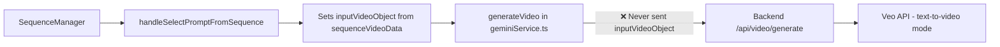

# Walkthrough: Prompt Sequence Extension Continuity Fix

## Summary

Fixed the "long shot" flow in the Prompt Sequence / Assistant UI so that Extension 1, Extension 2, etc. continue visually from the previous shot instead of generating fresh text-to-video clips.

## Root Cause

The issue was in the data flow between frontend and backend:



**The bug**: `generateVideo()` in `geminiService.ts` never extracted `.uri` from `inputVideoObject` and never sent it to the backend. All extensions were being generated as fresh text-to-video clips.

---

## Changes Made

### 1. Backend: `server.js`

Added support for `videoUri` parameter to enable Veo extend mode:

```diff
 app.post('/api/video/generate', async (req, res) => {
   try {
     const apiKey = getApiKey(req);
-    const { model, prompt, parameters } = req.body;
+    const { model, prompt, parameters, videoUri } = req.body;

     // ...

-    const requestBody = {
-      instances: [{ prompt: prompt.trim() }]
-    };
+    const instance = { prompt: prompt.trim() };
+
+    if (videoUri) {
+      instance.video = { uri: videoUri };
+      console.log(`[Veo] Extend mode enabled with base video: ${videoUri}`);
+    } else {
+      console.log('[Veo] Text-to-video mode (no base video)');
+    }
+
+    const requestBody = {
+      instances: [instance]
+    };
```

### 2. Frontend Service: `geminiService.ts`

Updated `generateVideo()` to detect extend mode and pass the video URI:

```diff
 export const generateVideo = async (params, signal, onProgress) => {
+  const videoUri = params.mode === GenerationMode.EXTEND_VIDEO && params.inputVideoObject?.uri
+    ? params.inputVideoObject.uri
+    : undefined;
+
+  if (videoUri) {
+    console.log(`[Sequence] Generating extension with mode=ExtendVideo, baseVideo=${videoUri}`);
+  } else {
+    console.log(`[Sequence] Generating root shot with mode=${params.mode}`);
+  }

   // ... existing code ...

   body: JSON.stringify({
     model: params.model,
     prompt: finalPrompt.trim(),
     parameters: ...,
+    videoUri: videoUri,
   }),
```

### 3. State Flow Logging: `Studio.tsx`

Added logging for debugging the sequence chain:

```typescript
// In handleGenerate success block
console.log('[Sequence] Storing video data for index', currentPromptIndex, 'video:', video);

// In handleSelectPromptFromSequence
console.log('[Sequence] Setting up Extension', index, 'with base video:', sequenceVideoData[index - 1]?.video);
```

---

## How It Works Now

1. **Root shot generated** → Veo returns `{ uri: "https://..." }` → Stored in `sequenceVideoData[0]`
2. **User clicks Extension 1** → `handleSelectPromptFromSequence` sets `inputVideoObject: sequenceVideoData[0].video`
3. **generateVideo called** → Extracts `inputVideoObject.uri` → Sends as `videoUri` to backend
4. **Backend receives videoUri** → Includes `video: { uri: ... }` in Veo API request
5. **Veo extends from last frame** → Visual continuity maintained

---

## Testing Verification

### Console Log Checks

After the fix, generating a sequence should show:

```
[Sequence] Generating root shot with mode=Text to Video
[Veo] Text-to-video mode (no base video)
...
[Sequence] Storing video data for index 0 video: { uri: "https://..." }

[Sequence] Setting up Extension 1 with base video: { uri: "https://..." }
[Sequence] Generating extension with mode=ExtendVideo, baseVideo=https://...
[Veo] Extend mode enabled with base video: https://...
```

### Manual Testing Steps

1. Start fresh, create a new sequence with Main Prompt + Extension 1 + Extension 2
2. Generate the root shot (8s)
3. Click "Use" on Extension 1 in the Prompt Sequence panel
4. Click Generate
5. **Check console** for `[Sequence] Generating extension with mode=ExtendVideo, baseVideo=...`
6. **Check backend logs** for `[Veo] Extend mode enabled with base video: ...`
7. **Verify visual continuity** - Extension should continue from the last frame

### Expected Behavior

- ✅ Extension videos start from the exact last frame of the previous shot
- ✅ Same characters, environment, and style maintained
- ✅ No "hard cut" or scene change between shots
- ✅ Normal one-shot extend (camera icon) still works as before
