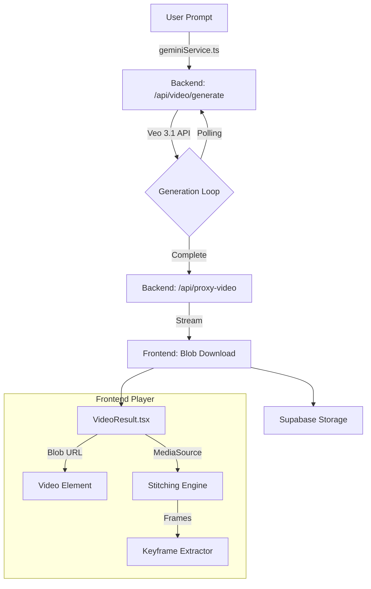

# Video Pipeline Architecture

**Status:** Implementation / Target Architecture  
**Dependencies:** Veo 3.1, Supabase, MediaSource API

---

## 1. High-Level Flow

The video pipeline transforms a user prompt into a playable, stitched video with generated keyframes.

## 2. Component Breakdown

### 2.1 Generation (Backend)
- **Endpoint:** `/api/video/generate`
- **Role:** Initiates Veo 3.1 generation task.
- **Polling:** `/api/video/status` checks progress every 5s.
- **Proxy:** `/api/proxy-video` securely streams the result from Google's temporary URL to the frontend, bypassing CORS restrictions.

### 2.2 Storage (Supabase)
- **Role:** Permanent hosting for generated videos.
- **Bucket:** `videos` (Path: `generated/{timestamp}-{name}.mp4`)
- **Flow:** 
  1. Frontend downloads video blob from Backend Proxy.
  2. Frontend uploads blob to Supabase via `supabaseClient.ts`.
  3. Public URL is generated for sharing/metadata.
  4. **Note:** The player *does not* use this URL for immediate playback; it uses the local Blob to avoid round-trip latency.

### 2.3 Playback & Stitching (VideoResult)
- **Primary Mode:** **MediaSource API**
  - Stitches `Original Video` + `Extension` into a single seamless stream.
  - Required for "Continue Sequence" flow to feel like one continuous movie.
- **Fallback Mode:** `video.src = blobUrl`
  - Used if MediaSource is unsupported (e.g., codec issues).
  - Plays only the extension clip.
  
### 2.4 Keyframe Extraction
- **Where:** Client-side in `VideoResult.tsx`.
- **How:** 
  1. Video is paused (invisible to user).
  2. `<canvas>` captures frames at specific timestamps.
  3. Frames are sent to `KeyframeRefinementAssistant` for the next "Extend" step.
  4. **Critical:** Requires valid video data; failure in playback (MediaSource error) blocks this.

---

## 3. Storage Abstraction (Target)

To support Google Cloud Storage (GCS) or Drive in the future, we use the `VideoStorageProvider` pattern.

- **Interface:** `VideoStorageProvider` (TypeScript)
- **Current Imp:** `SupabaseVideoStorage` (Default)
- **Future Imp:** `GCSVideoStorage`, `DriveVideoStorage`
- **Logic:** The UI (`VideoResult`) is agnostic; it just calls `storage.upload(blob)`.

---

## 4. Dev Notes

### 🟢 Safe to Change
- **Documentation:** Any `*.md` file in `docs/`.
- **UI Styling:** CSS/Tailwind classes in wrapper divs (avoid touching logic).
- **Storage Provider:** Adding a new `GCSVideoStorage` class class does not break existing flows.

### 🟡 Handle with Care
- **`geminiService.ts`**: Core orchestration logic. Changes here affect every generation.
- **Supabase Policies**: Changing bucket privacy/CORS can break uploads.

### 🔴 Critical Areas (Touch Only if Necessary)
- **`VideoResult.tsx`**: Contains complex state machines for:
  - MediaSource buffer appending (Stitching).
  - Canvas-based keyframe extraction.
  - Fallback logic.
  - *Risk:* Breaking this freezes the player or prevents "Extend" workflows.

### 🧪 How to Test

#### 1. Basic Generation
- **Action:** Enter prompt -> "Generate".
- **Verify:** Video plays. No console errors. "Save Shot" works.

#### 2. Extension (Stitching)
- **Action:** Click "Extend" on a result -> Generate new segment.
- **Verify:** 
  - Result plays as ONE continuous video.
  - "Download Combined" gives the full stitched file.

#### 3. Fallback Behavior
- **Action:** Force `MediaSource.isTypeSupported = () => false` in DevTools console before loading extension.
- **Verify:** 
  - Console warning: "MediaSource does not support..."
  - Player loads ONLY the new segment (no crash).
  - Keyframes still generated.
