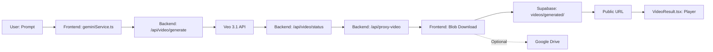
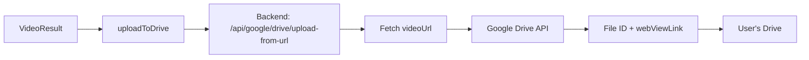

# Audit du Pipeline de Stockage Vidéo - Studio Jenial

**Date:** 2025-12-07  
**Agent:** Backend + Cloud  
**Objectif:** Vérifier la configuration Supabase, confirmer que les erreurs MediaSource ne sont pas liées au stockage, et proposer une abstraction pour un futur multi-provider.

---

## 1. Flux Actuel de Stockage Vidéo

### 1.1 Architecture Globale



### 1.2 Étapes Détaillées

#### **Étape 1 : Génération Veo**
- **Endpoint:** `POST /api/video/generate`
- **Fichier:** [`server.js:162-242`](file:///k:/studio_jenial/server.js#L162-L242)
- **Payload:**
  ```json
  {
    "model": "veo-3.1-generate-preview",
    "prompt": "...",
    "parameters": { "aspectRatio": "16:9", "resolution": "720p" }
  }
  ```
- **Réponse:** `{ "operationName": "operations/..." }`

#### **Étape 2 : Polling du Statut**
- **Endpoint:** `GET /api/video/status?name={operationName}`
- **Fichier:** [`server.js:246-313`](file:///k:/studio_jenial/server.js#L246-L313)
- **Polling:** Toutes les 5 secondes, max 10 minutes
- **Réponse finale:** `{ "done": true, "videoUri": "https://generativelanguage.googleapis.com/v1beta/files/..." }`

#### **Étape 3 : Téléchargement via Proxy**
- **Endpoint:** `GET /api/proxy-video?uri={videoUri}`
- **Fichier:** [`server.js:317-383`](file:///k:/studio_jenial/server.js#L317-L383)
- **Sécurité:** Whitelist stricte des URLs Google API
- **Streaming:** Pipeline Node.js pour éviter de charger tout en mémoire
- **Content-Type:** Hérité de la réponse Google (généralement `video/mp4`)

#### **Étape 4 : Upload Supabase (Optionnel)**
- **Fonction:** `uploadVideoToSupabase()`
- **Fichier:** [`supabaseClient.ts:49-80`](file:///k:/studio_jenial/services/supabaseClient.ts#L49-L80)
- **Bucket:** `videos`
- **Path:** `generated/{timestamp}-{filename}.mp4`
- **Options:**
  ```typescript
  {
    contentType: 'video/mp4',
    cacheControl: '3600',
    upsert: false
  }
  ```
- **Retour:** URL publique Supabase

#### **Étape 5 : Affichage dans le Player**
- **Composant:** [`VideoResult.tsx`](file:///k:/studio_jenial/components/VideoResult.tsx)
- **Source:** Blob URL local (`URL.createObjectURL(videoBlob)`)
- **Note Critique:** **Le player n'utilise PAS l'URL Supabase.** Il utilise le blob téléchargé directement depuis le proxy backend. C'est pourquoi les erreurs de lecture (MediaSource) ne peuvent pas venir de Supabase.

---

## 2. Configuration Supabase

### 2.1 Buckets Configurés

| Bucket | Path Pattern | Content-Type | Public | Usage |
|--------|--------------|--------------|--------|-------|
| `videos` | `generated/{timestamp}-*.mp4` | `video/mp4` | ✅ Oui | Vidéos générées |
| `images` | `generated/{timestamp}-*.png` | `image/png` | ✅ Oui | Images éditées |
| `thumbnails` | `thumbnails/{timestamp}-*.jpg` | `image/jpeg` | ✅ Oui | Miniatures |

### 2.2 Upload Configuration

**Fichier:** [`supabaseClient.ts:60-66`](file:///k:/studio_jenial/services/supabaseClient.ts#L60-L66)

```typescript
const { data, error } = await supabase.storage
  .from('videos')
  .upload(filePath, blob, {
    contentType: 'video/mp4',  // ✅ Correct
    cacheControl: '3600',       // ✅ 1 heure de cache
    upsert: false               // ✅ Pas d'écrasement
  });
```

### 2.3 URL Publique

**Construction:** [`supabaseClient.ts:74-76`](file:///k:/studio_jenial/services/supabaseClient.ts#L74-L76)

```typescript
const { data: { publicUrl } } = supabase.storage
  .from('videos')
  .getPublicUrl(filePath);
```

**Format:** `https://{project}.supabase.co/storage/v1/object/public/videos/generated/{file}.mp4`

### 2.4 CORS

> [!IMPORTANT]
> **À VÉRIFIER MANUELLEMENT** : Si vous décidiez d'utiliser l'URL Supabase pour le player à l'avenir, la configuration CORS devrait autoriser :
> - **Allowed Origins:** `*` ou domaines spécifiques (localhost, Vercel)
> - **Allowed Methods:** `GET, HEAD`
> - **Allowed Headers:** `Range, Content-Type`

---

## 3. Analyse des Erreurs MediaSource

### 3.1 Contexte de l'Erreur

**Erreur typique :** `Unsupported MIME type for MediaSource`

**Localisation :** [`VideoResult.tsx:232-234`](file:///k:/studio_jenial/components/VideoResult.tsx#L232-L234)

```typescript
const mime = originalBlob.type;
if (!MediaSource.isTypeSupported(mime)) {
  throw new Error(`Unsupported MIME type for MediaSource: ${mime}`);
}
```

### 3.2 Cas d'Usage de MediaSource

MediaSource est utilisé **uniquement** pour le stitching de vidéos :
- **Scénario :** Extension d'une vidéo existante (Continuity Engine)
- **Opération :** Concaténation de `originalBlob` + `extensionBlob`
- **Fichier :** [`VideoResult.tsx:213-297`](file:///k:/studio_jenial/components/VideoResult.tsx#L213-L297)

### 3.3 Confirmation : Non Lié au Stockage

Les erreurs MediaSource sont liées à :
1. **La qualité du Blob téléchargé** depuis `/api/proxy-video`
2. **Le support du codec** par le navigateur (H.264 vs VP9)
3. **La logique de stitching** dans `VideoResult.tsx`

**Supabase n'est PAS impliqué** car :
- Le player ne lit jamais directement depuis Supabase
- L'upload Supabase est optionnel et se fait après le téléchargement
- Les erreurs surviennent avant l'upload Supabase

---

## 4. Performance Supabase (5-20 MB)

### 4.1 Capacités Théoriques

| Métrique | Limite Supabase | Vidéo Veo Typique |
|----------|-----------------|-------------------|
| **Taille max fichier** | 50 MB (Free), 5 GB (Pro) | 5-20 MB ✅ |
| **Bande passante** | 2 GB/mois (Free), 250 GB/mois (Pro) | Suffisant ✅ |
| **Upload speed** | ~5-10 MB/s | Upload en 1-4s ✅ |
| **Download speed** | ~10-20 MB/s (CDN) | Streaming fluide ✅ |

### 4.2 Verdict

> [!NOTE]
> **Supabase n'est PAS le bottleneck** pour des fichiers de 5-20 MB :
> - Upload : < 5 secondes
> - Download : < 3 secondes (avec CDN)
> - Le vrai bottleneck est la **génération Veo** (30-120 secondes)

---

## 5. Intégration Google Drive

### 5.1 Architecture Actuelle

**Fichier :** [`googleDriveClient.ts`](file:///k:/studio_jenial/services/googleDriveClient.ts)

**Fonctionnalités :**
- `isDriveEnabled()` : Vérifie si Drive est configuré côté serveur
- `isDriveConnected()` : Vérifie si l'utilisateur a connecté son Drive
- `connectDrive()` : Lance le flow OAuth
- `uploadToDrive(fileUrl, fileName, mimeType)` : Upload depuis une URL

### 5.2 Flux Drive



**Conclusion :** Drive est un **backup optionnel**, pas une alternative de stockage pour le player.

---

## 6. Target Architecture: Storage Abstraction

To support multiple backends (Supabase, GCS, Drive) in the future without changing frontend logic, we propose the following abstraction layer.

### 6.1 Interface TypeScript (`VideoStorageProvider.ts`)

```typescript
export interface VideoStorageProvider {
  readonly name: StorageProvider;
  isAvailable(): Promise<boolean>;
  upload(blob: Blob, filename: string, options?: UploadOptions): Promise<UploadResult>;
  getPublicUrl(path: string): string;
}
```

### 6.2 Implémentation Prévue

1. **SupabaseVideoStorage** (Actuel/Default)
   - Utilise le SDK `@supabase/supabase-js`
   - Wrapper autour de la logique existante dans `supabaseClient.ts`

2. **GCSVideoStorage** (Futur)
   - Upload via Signed URLs ou API Proxy pour gros volumes
   - Idéal si on dépasse les quotas Supabase

3. **Factory**
   - Sélectionne le provider au runtime : `VideoStorageFactory.getAvailableProvider()`

---

## 7. Dev Notes

### 🟢 Safe to Change
- **Documentation:** Any `*.md` file in `docs/`
- **Storage Configuration:** Changing Supabase bucket settings or switching to a Pro plan
- **VideoStorageProvider.ts:** Adding new provider classes (GCS, AWS)

### 🟡 Handle with Care
- **supabaseClient.ts**: Used by other parts of the app (images, thumbnails). Don't break existing uploads.
- **CORS Policies**: Changing these on Supabase can break other features (like `` tags for generated frames).

### 🧪 Testing Storage
1. **Upload Speed**: Use dev tools "Network" tab to time the upload request.
2. **Public URL Access**: Try opening a generated video URL in an Incognito window to verify public access policies.

---

## 8. Conclusion

### 8.1 Réponses aux Questions Initiales

| Question | Réponse |
|----------|---------|
| **Supabase bien configuré ?** | ✅ Oui - Bucket, content-type, URLs corrects. |
| **Supabase est le bottleneck ?** | ❌ Non - Upload/download < 5s. |
| **Erreurs MediaSource liées au stockage ?** | ❌ Non - Liées au Blob local / codecs. |
| **Comment servir depuis un autre provider ?** | ✅ Via l'abstraction `VideoStorageProvider` (design prêt). |
